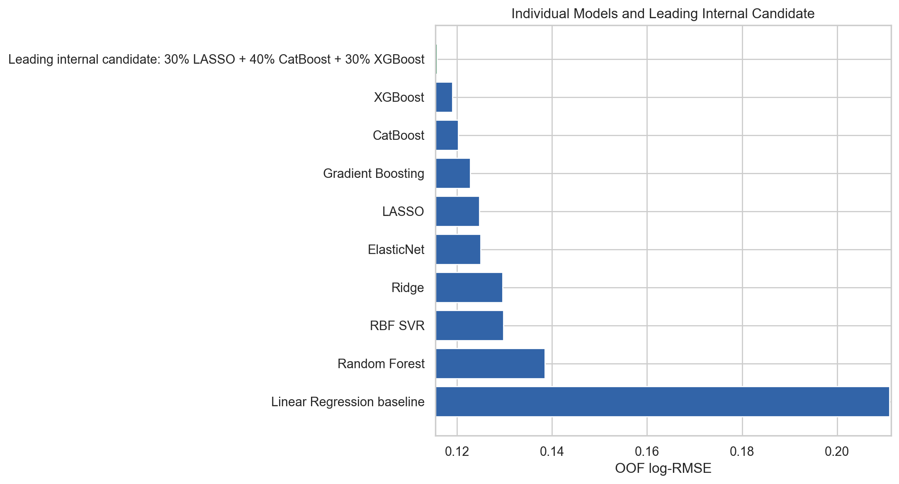
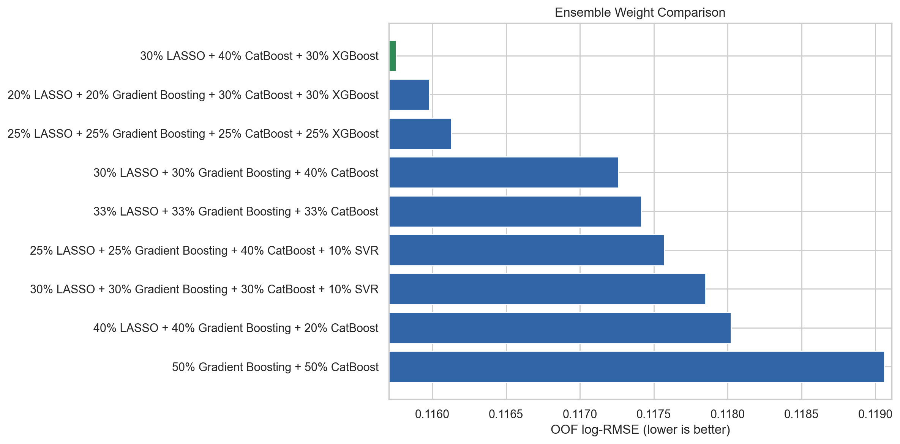
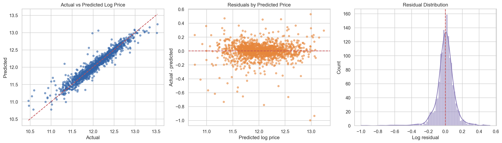

# House Prices: Validation-Driven Ensemble Modeling

An end-to-end regression project for Kaggle's House Prices competition, covering exploratory analysis, leakage-safe preprocessing, model comparison, residual diagnostics, and ensemble selection.

> **Result:** public Log-RMSE of **0.11843**, ranking **115th of approximately 3,449 entries (top 3.3%)** at the time recorded.

[View the portfolio page](https://mikechen47.github.io/house-prices-advanced-regression/) · [Open the notebook](notebooks/house-prices-analysis.ipynb)



## Project summary

The goal was to predict residential sale prices from 79 property characteristics in the Ames housing dataset. The main challenges were extensive missing values, skewed variables, high-cardinality categories, correlated property measures, and a small number of unusual homes.

The analysis used a consistent five-fold out-of-fold validation design to compare linear, regularized, kernel, bagging, and boosting models. All learned preprocessing was fitted inside each training fold to reduce leakage risk.

### Results at a glance

| Measure | Result | Why it matters |
|---|---:|---|
| Training sample | 1,460 homes | Small relative to the number and variety of predictors |
| Best linear model | LASSO, 0.12465 OOF Log-RMSE | Regularization improved the linear baseline |
| Best individual model | XGBoost, 0.11897 OOF Log-RMSE | Nonlinear relationships added predictive value |
| Best internal ensemble | 0.11575 OOF Log-RMSE | Lowest five-fold score in the final notebook |
| Best public submission | 0.11843 Log-RMSE | Rank 115, approximately top 3.3% |

The best public submission blended **30% LASSO, 30% Gradient Boosting, and 40% CatBoost**. The lowest internal validation score came from a separate **30% LASSO, 40% CatBoost, and 30% XGBoost** ensemble. Keeping those results distinct prevents leaderboard feedback from being presented as cross-validation evidence.

## Analytical approach

1. Audited the training and test structures, missingness, duplicate identifiers, and target distribution.
2. Interpreted structural missing values such as “no garage” or “no basement” as information rather than generic data errors.
3. Applied log-target modeling, fold-safe imputation, scaling, one-hot encoding, and interpretable engineered features.
4. Compared Linear Regression, Ridge, LASSO, ElasticNet, SVR, Random Forest, Gradient Boosting, CatBoost, and XGBoost with the same folds.
5. Used residual patterns and prediction correlations to identify models that made meaningfully different errors.
6. Tested explicit ensemble weights and validated every submission file before upload.



## Decisions supported by evidence

- **Log transform:** reduced target skewness from about 1.88 to 0.12 and aligned training with the competition metric.
- **Outliers:** retaining four homes above 4,000 square feet outperformed removing them in cross-validation.
- **Feature engineering:** targeted quality, age, basement, and garage features slightly improved LASSO.
- **Ensembling:** combined a sparse linear model with tree-based learners because their residuals were not identical.
- **Model selection:** used out-of-fold predictions for internal decisions and reported public leaderboard results separately.



## Repository structure

```text
.
├── data/                 # Download instructions; competition files are not redistributed
├── docs/                 # GitHub Pages site
├── notebooks/            # Cleaned analysis notebook
├── .gitignore
├── README.md
└── requirements.txt
```

## Reproduce the analysis

1. Download `train.csv`, `test.csv`, `sample_submission.csv`, and `data_description.txt` from the [Kaggle competition data page](https://www.kaggle.com/competitions/house-prices-advanced-regression-techniques/data).
2. Place those four files in `data/`.
3. Create an environment and install the dependencies:

```bash
python -m venv .venv
python -m pip install -r requirements.txt
```

4. Open `notebooks/house-prices-analysis.ipynb` and run all cells.

The notebook creates figures, validation summaries, and candidate submission files locally. Generated files and Kaggle data are excluded from version control.

## Limitations

- Validation used one shuffled five-fold split; repeated cross-validation would provide a stronger uncertainty estimate.
- Hyperparameter tuning and ensemble-weight search were intentionally limited.
- Public leaderboard feedback is based on only part of the hidden test set and should not replace internal validation.
- Rare and high-end homes remain difficult because the training sample contains few comparable observations.

## Sources

- [Kaggle: House Prices - Advanced Regression Techniques](https://www.kaggle.com/competitions/house-prices-advanced-regression-techniques)
- De Cock, D. (2011). [Ames, Iowa: Alternative to the Boston Housing Data as an End of Semester Regression Project](https://doi.org/10.1080/10691898.2011.11889627)
